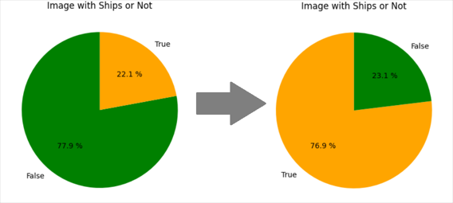
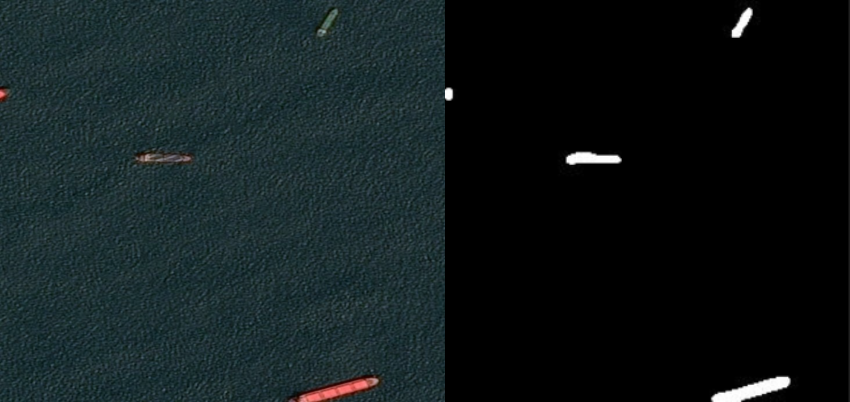

# About The Project
</img>

## Airbus Ship Detection Challenge 

In this project I will try to solve the legendary kaggle competition - <a href='https://www.kaggle.com/competitions/airbus-ship-detection'>Airbus Ship Detection Challenge</a>. This competition encourages participants to develop a model for the rapid and accurate detection of all ships in satellite images. This readme file has a Description of solution but it will be easier to look at the jupyter notebook which also has explanations along with the code.

## Description of solution

At the beginning, I decided to explore the data and found that about 80% of the data had no ships at all, which I thought might have a negative impact on model training, so I decided to reduce the percentage of images without ships to 23%.

<p align="center">
    
</p>

Another important point is that the image masks were encoded using the RLE algorithm. Run-Length Encoding (RLE) in the context of images is a coding algorithm that represents the mask of regions on an image by recording the length of consecutive rows or columns of identical values, allowing for efficient storage and transmission of information about the shape and location of objects.

<p align="center">
    
</p>

Then I started developing metrics and the model itself. I chose the Unet architecture to solve the semantic segmentation problem because of its efficient ability to take into account both local and global contexts in images. Due to its architecture, Unet is able to detect and preserve object details, which allows for accurate and clear segmentations. I also took some layers of pretreined model VGG19 as a backbone for easier model training.

<p align="center">
    
</p>

I chose IoU (Intersection over Union) as a cost function because this metric provides a highly sensitive measure of segmentation accuracy by considering both the intersection and union regions between the predicted and true masks. Using IoU as a cost function helps to optimize the model to maximize the similarity between them, which is key in semantic segmentation tasks. I also used Dice to check the quality of the model on validation data.

<p align="center">
    
</p>

Since I have limited computing power, I reduced the images by a factor of 3 and they were trained with a size of 256x256. I also had to make the architecture not very deep for the same reason. I trained the model for about 5 hours and it showed a good result, I also sent a submission to kuggle and got a score of 0.661 on the private score and 0.435 on the public score.

<p align="center">
    
</p>

## Navigate

* <b>infer_model.py</b> - This file load model and forms the result (image segmentation) in the <b>result.jpeg</b>.
* <b>Ship_segmentation.ipynb</b> - jupyter notebook with exploratory data analysis of the dataset and explains the underlying principles of my solution.
* <b>model.py</b> - This file contains the model code.
* <b>preprocessing.py</b> - This file contains helper functions for preprocessing.
* <b>utilites.py</b> - This file contains cost functions, metrics and a data generator.
* <b>train_model.py</b> - This file is for training the model, but I trained the model in jupyter notebook.

### Usage

* To create file with results execute this command:
   ```sh
   python infer_model.py --image_path your_path
   ```

## My talk

This project was developed for educational purposes and was not intended to show very high results on kuggle, but in the future I would like to improve the results. One of the reasons that I think prevents me from improving my results is computing power. As soon as I create a model, my GPU memory is almost immediately completely full. I would also like to talk about the disadvantages of this project. Since I am not an experienced ML engineer, my code may not be very well written, and for better memory management, I may use the Eager mod. Also, I am not sure that the structure of my project is good. In conclusion, I want to say that this project taught me a lot of new things and gave me valuable experience, I will continue to develop in this direction and may return to this project with better knowledge.